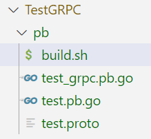

# TestGRPC

本项目为一个简单的gRPC的使用案例，实现了客户端构建请求消息，向服务器发送消息，服务器接收并处理消息，服务器向客户端返回响应消息，客户端接收并处理响应消息。

## 1 安装 gRPC 

golang-grpc包提供了gRPC相关的代码库，安装命令为：`go get -u google.golang.org/grpc`

安装两个包，用于支持 protobuf 文件的处理：

```
go get -u github.com/golang/protobuf
go get -u github.com/golang/protobuf/protoc-gen-go
```

## 2 安装 Protocol Buffers

Protocol Buffers 是一个与编程语言无关、与平台无关的可拓展机制，用于序列化结构数据，是一种数据交换格式，gRPC 使用 protoc 作为协议处理工具。

Step1. 下载与当前系统相对应的包`protoc-26.1-linux-x86_64.zip`，下载地址：https://github.com/protocolbuffers/protobuf/releases

Step2. 解压设置系统PATH。将`bin/ptotoc.exe`文件复制到`/root/pkg/protoc/bin`目录下，使用命令`export PATH=/root/pkg/protoc/bin:$PATH`配置系统PATH。

Step3. 测试proto编译。在项目的某个目录下新建一个`test.proto`文件，写入下面的代码，执行命令`protoc --go_out=. --go-grpc_out=. test.proto`，会在同目录下生成`test_grpc.pb.go`和`test.pb.go`两个文件。

```go
syntax = "proto3";

option go_package = "./";

service MyService {
    rpc Process(Request) returns (Response);
}

message Request {
    string message = 1;
}

message Response {
    string result = 1;
}
```

注意：①`option go_package = "./";`意思是输出目录是`test.proto`文件所在的目录，如果为`option go_package = "./pb";`则会在`test.proto`文件所在的目录下创建`pb`目录；②如果报`plugins are not supported`错误，可以尝试下载最新版本解决，命令为`go install google.golang.org/grpc/cmd/protoc-gen-go-grpc@latest`；③可以使用`.sh`脚本实现`.proto`文件的编译，例如新建`build.sh`文件，在里面输入以下代码，使用命令`chmod +x build.sh`添加执行权限，使用命令`./build.sh`执行脚本。

```bash
#!/bin/bash

# 执行 protoc 命令生成 Go 代码和 gRPC 相关的代码
protoc --go_out=. --go-grpc_out=. test.proto
```

脚本执行后的结果如下图所示：



## 3 实现服务器

Point 1. 构造服务器结构体

```go
type server struct {
	pb.UnimplementedMyServiceServer // 嵌入未实现的 gRPC 服务器结构体
}
```

Point 2. 实现方法

```go
func (s *server) Process(ctx context.Context, req *pb.Request) (*pb.Response, error) {
	log.Printf("Received message from client: %s", req.Message)
	// 在这里处理请求，并生成响应
	return &pb.Response{Result: "Processed: " + req.Message}, nil
}
```

Point 3. 主函数运行代码

①设置监听端口

```go
lis, err := net.Listen("tcp", ":50051")
if err != nil {
	log.Fatalf("failed to listen: %v", err)
}
```

②用pb实例化服务器

```go
s := grpc.NewServer()
pb.RegisterMyServiceServer(s, &server{})
```

注意：服务器会一直监听，若在终端中使用`ctrl+z`终止服务，端口会一直被进程占用，因而无法再次以同一个端口启动服务器。可以使用`s aux | grep go`查看当前go启动的进程，使用`kill -9 <pid>`强制终止进程。

## 4 实现客户端

Point 1. 设置连接地址并建立连接

```go
const (
	address = "localhost:50051"  //如果服务器在不同的物理机，则将localhost设置为相应ip
)
//main函数中
conn, err := grpc.Dial(address, grpc.WithTransportCredentials(insecure.NewCredentials()), grpc.WithBlock())
if err != nil {
	log.Fatalf("did not connect: %v", err)
}
defer conn.Close()
c := pb.NewMyServiceClient(conn)
```

Point 2. 构造请求消息

```go
req := &pb.Request{
	Message: "Hello from client",
}
```

Point 3. 向服务器发送请求

```go
res, err := c.Process(context.Background(), req)
if err != nil {
	log.Fatalf("could not process request: %v", err)
}
```

Point 4. 处理服务器返回的响应（此处仅是打印处理结果）

```go
log.Printf("Received response from server: %s", res.Result)
```

